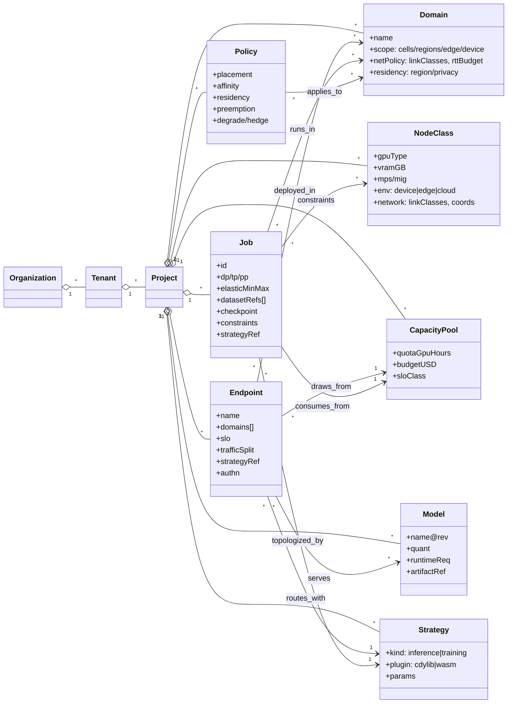
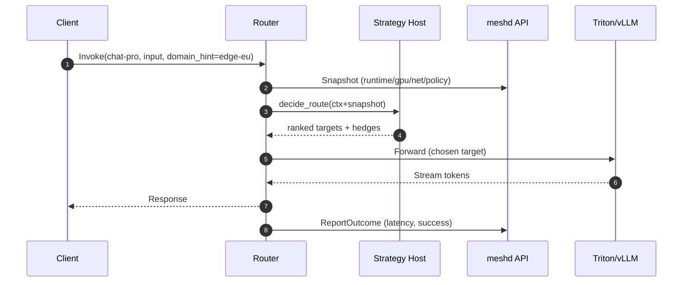
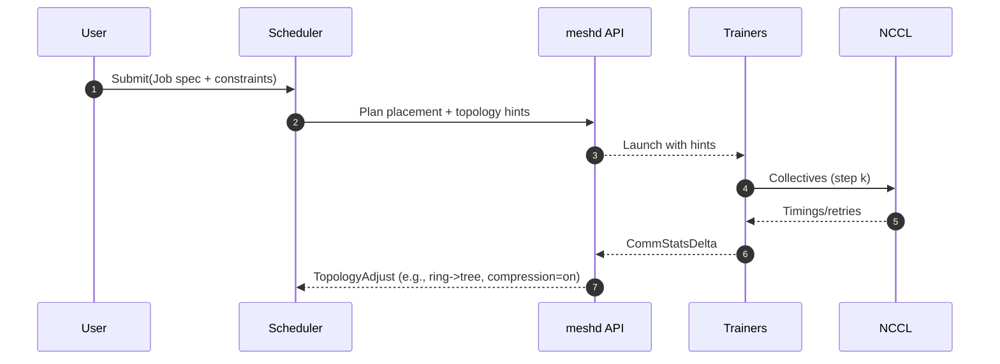

# InferMesh Application Architecture for Users

This document describes the application architecture of InferMesh from a user/customer perspective. It focuses on the objects you manage, the APIs you call, and the workflows you run when operating inference and training across cloud/edge/device, multi-WAN, and multi-model scenarios.

---

## Personas & Tenancy Model

- Org Admin – creates orgs/tenants, configures identity, billing, global policy.
- Platform Admin – manages capacity pools, domains, node classes, WAN policies.
- Model Owner – publishes models and inference endpoints; manages traffic splits & SLOs.
- Job Owner – submits training jobs, sets elasticity, checkpoint cadence, constraints.
- SRE/Operator – monitors SLOs, handles incidents, manages rollouts/quarantines.
- Developer – uses SDK/CLI to invoke endpoints, run experiments, and read metrics.

Tenancy Hierarchy: Organization → Tenant → Project (namespaces). Policies, quotas, and RBAC apply at any level.

---

## Environments & Topologies

Cloud / Edge / Device
- Device nodes (phones, laptops, on-prem gateways): intermittent, privacy-scoped, limited VRAM; may only run small models or partial pipelines.
- Edge nodes (PoPs, micro-DCs): low latency to users; constrained WAN egress; ideal for pre/post-processing and small/medium models.
- Cloud nodes (regions/zones): abundant capacity; higher RTT; ideal for large models and multi-GPU jobs.

Multi-WAN
- WAN links are classified (e.g., intra-zone, inter-zone, inter-region, public), each with link class (bandwidth/latency/loss).
- InferMesh policies declare degrade/failover rules per link class; strategies consume network coordinates to price WAN cost.

Cells & Shards
- Large fleets are partitioned into cells (500–2,000 nodes each). Domains, capacity pools, and policies can be scoped per cell and rolled up globally.

---

## Core Concepts (User-Facing Object Model)

### Domain (Inference execution “space”)

A Domain groups capacity and policy for one or more models in a locality/context (e.g., edge-eu, cloud-us, device-ios). Domains map to:
- Placement scope (cells/regions/edges/devices)
- Network constraints (link classes allowed, max RTT/bw budget)
- Security boundary (data residency, privacy flags)

Domains are the primary handle for multi-model inference: each endpoint lives in one or more domains, and routing strategies can consider domain affinity plus WAN cost.

### NodeClass

A NodeClass describes a category of nodes by capability and policy:
- Hardware: GPU type, VRAM, MIG/MPS support, NVLink/IB, CPU/mem.
- Environment: device|edge|cloud, provider, zone/region.
- Network: link classes, coordinates.
- Constraints: power caps, spot/preemptible, data residency.

### CapacityPool

A logical pool of capacity with accounting/quota:
- Backed by one or more NodeClasses and Domains.
- Provides quota, budget, and SLO class (e.g., gold, silver).
- Used by endpoints and training jobs for reservations/limits.

### Model & Artifact

- Metadata: name, revision, quantization, runtime requirements, VRAM footprint.
- Artifact refs: OCI image, HF repo, S3 path, TensorRT engine, etc.
- Optional: tokenizer/config, KV-cache policy, warmup script.

### Endpoint (Inference)

- Binds a Model to one or more Domains with traffic policy (AB/canary), SLOs, strategy, and auth.
- Exposed as HTTP/gRPC with streaming; labeled for multi-tenant observability.

### Job (Training)

- Spec for distributed training: DP/TP/PP parallelism, dataset refs, elastic min/max GPUs, topology preferences, checkpoint cadence, and constraints (NodeClass/Domain/affinity).

### Policy

Declarative constraints and behaviors:
- Placement (affinity/anti-affinity), residency, allowed link classes.
- Capacity (quotas, budgets), priority/queue class, preemption rules.
- Rollout (canary %, failure gates), degradation/hedging rules.
- Strategy selection + parameters.

### Strategy (Pluggable)

- InferenceStrategy: returns ranked targets/hedges for requests.
- TrainingStrategy: returns placement and topology hints per job/step.
- Shipped built-ins (e.g., hybrid_mesh) and user-defined plugins (Rust cdylib or WASM). Same interface for both.

### Observability Objects

- Metrics series (Prometheus/OpenMetrics), traces (OTLP), logs.
- SLOs as first-class objects (targets + error budgets).
- Events & Audit stream for governance and incident review.

---

## Object Relationships (Mermaid)



---

## APIs (User-Visible Interfaces)

### Control Plane (gRPC + JSON/HTTP)

Key endpoints (path names exemplary):
- Domains
  - POST /v1/domains – create; GET /v1/domains – list; PATCH /v1/domains/{id} – update; DELETE /v1/domains/{id} – delete
- NodeClasses
  - POST /v1/nodeclasses; GET /v1/nodeclasses
- CapacityPools
  - POST /v1/capacitypools; GET /v1/capacitypools
- Models
  - POST /v1/models (with artifact refs); POST /v1/models/{id}:publish
- Endpoints (Inference)
  - POST /v1/endpoints (bind model + domains + SLO + strategy)
  - POST /v1/endpoints/{id}:trafficSplit (AB/canary)
  - POST /v1/endpoints/{id}:pin (placement pins), :drain, :quarantine
- Jobs (Training)
  - POST /v1/jobs (dp/tp/pp, elasticity, constraints, strategy)
  - POST /v1/jobs/{id}:pause|resume|scale|checkpoint
- Policies
  - POST /v1/policies (placement, residency, priority, preemption, degradations)
- Strategies
  - POST /v1/strategies (register plugin), GET /v1/strategies
- Observability
  - GET /v1/metrics/series (labels), GET /v1/traces, GET /v1/events/stream (SSE/gRPC)

Auth via OIDC/JWT; mTLS on all server-server calls.

### Data Plane (Ingress)

- Inference: POST /v1/endpoint/{name}:invoke (HTTP/2 gRPC/HTTP; streaming supported). Headers carry tenant, traceparent, domain_hint (optional).
- Training: jobs are control-plane submitted; runtime data flows via datasets/checkpoints connectors managed by IO adapters.

### Strategy Plugins (High-Level Intro)

- Same interface for built-in and user-defined strategies (see docs/STRATEGIES.md).
- InferenceStrategy input: request context, candidate targets, snapshot (runtime/GPU/network/policy/history). Output: ranked targets + hedges + admit token.
- TrainingStrategy input: job spec, step/bucket info, candidates, snapshot. Output: placement + topology hints (ring/tree/hierarchical, fusion window, compression).
- Packaging as Rust cdylib or WASM; params configurable via policy.

⸻

## Multi-WAN Requirements & Behaviors

- Link Classes (policy): allowed classes ["intra-zone","inter-zone","inter-region","public"] with cost multipliers and RTT budgets.
- Graceful Degradation:
- Inference: prefer local domain; if RTT budget exceeded or congestion ↑, apply hedging or local-only fallback.
- Training: switch topology hints (ring→tree→hierarchical), enable compression on slow paths, extend fusion window.
- Partial Connectivity:
- Device/edge domains continue operating with local knowledge; cross-cell summaries refresh opportunistically.
- Idempotency:
- Inference requests include an idempotency key to avoid duplicates during WAN retry/hedge.
- Training jobs checkpoint on policy to tolerate transient WAN faults.

⸻

## Cloud/Edge/Device Node Classification

Routing and placement consume NodeClass attributes:
- Performance: tokens/sec, VRAM headroom, SM%, NUMA, NVLink/IB presence.
- Stability: ECC/thermals, power cap, preemptible/spot risk.
- Locality: topology group (rack/zone/region), device proximity to the caller.
- Policy: residency flag, privacy scope, cost weights.

Example NodeClass:

```yaml
apiVersion: v1
kind: NodeClass
metadata: { name: edge-h100-eu }
spec:
  hardware: { gpu: H100-80G, vramGB: 80, mig: enabled, nvlink: true }
  environment: { kind: edge, provider: "isp-x", region: eu-west }
  network: { linkClasses: ["intra-zone","inter-zone"], rttBudgetMs: 15 }
  constraints: { spot: false, residency: "EU" }
```

---

## Multi-Model Inference: Domains & Endpoints

- Each Endpoint declares one or more Domains with traffic weights and SLOs.
- Strategies receive domain hints and can trade off SLO vs cost vs WAN.
- KV-cache policy and pre-warming can be set per domain.

Example Endpoint:

```yaml
apiVersion: v1
kind: Endpoint
metadata: { name: chat-pro }
spec:
  modelRef: "chat-70b@q4_k_m"
  domains:
    - name: edge-eu
      weight: 60
      slo: { p95_ms: 300, ttft_ms: 120 }
    - name: cloud-eu
      weight: 40
      slo: { p95_ms: 350, ttft_ms: 140 }
  strategy:
    ref: "hybrid_mesh@1.0"
    params: { net_penalty: 0.7, cold_penalty: 0.2 }
  capacityPoolRef: "prod-gold"
  auth: { required: true, audience: ["chat-app"] }
```

---

## Concurrent Training: Jobs, Queues, and Capacity

- Job types: pre-training, fine-tuning/LoRA, eval.
- Queues per priority class with dominant-resource fairness; preemption governed by policy.
- CapacityPools enforce GPU-hour quotas and budgets; elastic min/max GPUs per job.
- Placement constraints via NodeClass/Domain; topology hints adapt per step.

Example Job:

```yaml
apiVersion: v1
kind: Job
metadata: { name: ft-news-xxl }
spec:
  parallelism: { dp: 32, tp: 4, pp: 2 }
  elastic: { min_gpus: 128, max_gpus: 256 }
  datasets:
    - uri: s3://corp-ds/news-clean/
  checkpoint: { uri: s3://ckpt/ft-news-xxl/, interval_steps: 500 }
  constraints:
    nodeClasses: ["cloud-h100", "hpc-h100-ib"]
    domains: ["cloud-us", "cloud-eu"]
    residency: "US|EU"
  strategy:
    ref: "net_aware_hier@1.0"
    params: { inter_fanout: 4, compression: true }
  capacityPoolRef: "train-gold"
```

---

## Workflows

### Inference Across Domains (Sequence)



### Training with Multi-WAN (Sequence)



---

## SLOs, Policies, and Degradation Rules

- SLO examples: inference p95_ms, ttft_ms; training step_time_p95, throughput_tps.
- Degrade rules (per Endpoint/Job): enable hedging, prefer local domain only, relax cost cap, or reduce batch size.
- Quarantine rules: ECC/thermal thresholds, WAN loss thresholds, error rate spikes.

---

## Security, Governance, and Cost

- RBAC with roles: orgAdmin, platformAdmin, modelOwner, jobOwner, viewer.
- mTLS for all server-server; JWT/OIDC for clients.
- Audit: immutable event log of policy/placement/strategy changes.
- Cost Tracking: per label set (tenant, project, endpoint, job_id) to feed billing reports.
- Residency & Privacy: policy enforces where data can flow; device-only flags for sensitive inputs.

---

## SDK/CLI Overview (User Experience)

- CLI (mesh-cli): mesh domain create, mesh endpoint deploy, mesh job submit, mesh policy set, mesh strategy register, mesh stats, mesh events tail.
- SDKs (HTTP/gRPC): idiomatic clients for invoking endpoints, managing objects, and subscribing to events/metrics.

---

## Minimal YAML Cheatsheet

```yaml
# Domain
apiVersion: v1
kind: Domain
metadata: { name: edge-eu }
spec:
  scope: { cells: ["eu-west/*"] }
  netPolicy: { allowLinkClasses: ["intra-zone","inter-zone"], rttBudgetMs: 25 }
  residency: { region: "EU", privacy: "edge-preferred" }

# Capacity Pool
apiVersion: v1
kind: CapacityPool
metadata: { name: prod-gold }
spec:
  sloClass: gold
  quotaGpuHours: 20000
  budgetUSD: 50000

# Strategy
apiVersion: v1
kind: Strategy
metadata: { name: hybrid_mesh@1.0 }
spec:
  kind: inference
  plugin: builtin
  params: { net_penalty: 0.7, cold_penalty: 0.2 }

# Endpoint
apiVersion: v1
kind: Endpoint
metadata: { name: chat-pro }
spec:
  modelRef: "chat-70b@q4_k_m"
  domains: [{ name: edge-eu, weight: 60 }, { name: cloud-eu, weight: 40 }]
  slo: { p95_ms: 300, ttft_ms: 120 }
  strategy: { ref: "hybrid_mesh@1.0" }
  capacityPoolRef: "prod-gold"

# Job
apiVersion: v1
kind: Job
metadata: { name: ft-news-xxl }
spec:
  parallelism: { dp: 32, tp: 4, pp: 2 }
  elastic: { min_gpus: 128, max_gpus: 256 }
  datasets: [{ uri: s3://corp-ds/news-clean/ }]
  checkpoint: { uri: s3://ckpt/ft-news-xxl/, interval_steps: 500 }
  constraints: { nodeClasses: ["cloud-h100"], domains: ["cloud-us"] }
  strategy: { ref: "net_aware_hier@1.0" }
  capacityPoolRef: "train-gold"
```

## What Success Looks Like

- Inference: p95 latency within SLO under bursty load; cost/1k tokens meets budget; graceful degradation on WAN issues; endpoints isolated by domain and residency policy.
- Training: step-time p95 stable across WAN variance; jobs meet throughput target; elastic scaling honors quotas; preemption and checkpoint policies minimize wasted GPU-hours.
- Operations: clear dashboards; explainable strategy decisions; safe rollouts via AB/canary; auditable policy changes.

---

This architecture is intentionally user-facing: the objects, APIs, and behaviors you interact with to operate inference and training across cloud/edge/device and multi-WAN, multi-model environments.
