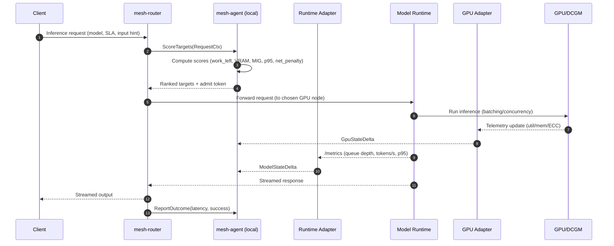

# infermesh Architecture

This document provides a detailed description of the **infermesh** architecture, its components, and the interfaces used across the system.

---

## High-Level Overview

infermesh is a **GPU-aware inference mesh** that provides routing, observability, and control for large-scale AI inference workloads.  
It is designed for heterogeneous and distributed environments where nodes may differ in GPU capability, network latency, and bandwidth.

The mesh is composed of three cooperating planes:

1. **Data Plane** – Handles inference traffic routing and request forwarding.  
2. **Signal Plane** – Collects runtime and GPU telemetry, fuses state, and provides scoring APIs.  
3. **Control Plane** – Maintains policies, placements, and exposes a distributed management API.

### System Architecture (Mermaid)

```mermaid
flowchart LR
  %% Styles
  classDef plane fill:#f8f9fb,stroke:#d0d7de,stroke-width:1px,color:#333;
  classDef core fill:#eef6ff,stroke:#84a9ff,stroke-width:1px,color:#0b2e66;
  classDef adapter fill:#eefcf4,stroke:#8fd19e,stroke-width:1px,color:#145c2e;
  classDef external fill:#fff7e6,stroke:#f0b429,stroke-width:1px,color:#6a3d00;
  classDef runtime fill:#f7ecff,stroke:#c69cf2,stroke-width:1px,color:#442266;

  %% Clients & Ingress
  subgraph Clients/Ingress
    C[Clients / SDKs / Services]
    R[mesh-router<br/>HTTP/2 gRPC, HTTP, WS/SSE]:::core
    C -->|"HTTP/2 gRPC / HTTP (streaming)"| R
  end

  %% Node (generic)
  subgraph Node (any role)
    direction TB
    A[mesh-agent (meshd)<br/>/metrics + OTLP]:::core
    S[State Fusion & Scoring API<br/>ScoreTargets/Admit/ReportOutcome]:::core
    G[mesh-gossip (SWIM)]:::core
    RF[mesh-raft (policies/placements/ACLs)]:::core

    subgraph GPU Node Internals
      direction TB
      RA[Runtime Adapter<br/>(Triton/vLLM/TGI/...)]:::adapter
      GA[GPU Telemetry Adapter<br/>(DCGM/NVML)]:::adapter
      RT[Model Runtime<br/>(Triton / vLLM / TGI / TorchServe / TF Serving / OVMS)]:::runtime
      GPU[GPU(s) + MIG/MPS]:::runtime
      DCGM[DCGM / NVML]:::runtime
      RA -->|"ControlModel (load/unload/warm)"| RT
      RA -->|"/metrics (Prometheus)"| RT
      GA -->|"util/mem/ECC/MIG"| DCGM
      DCGM --> GA
    end

    A --> S
    A --> G
    A --> RF
    RA -->|"gRPC stream: ModelStateDelta"| A
    GA -->|"gRPC stream: GpuStateDelta"| A
  end

  %% Router <-> Agent hot path
  R -->|"UDS/TCP gRPC: ScoreTargets/Admit"| A

  %% Optional external sinks
  subgraph Observability (optional)
    P[Prometheus / Grafana]:::external
    OT[OpenTelemetry Collector]:::external
  end
  A -->|"/metrics"| P
  R -->|"/metrics"| P
  RA -->|"/metrics"| P
  GA -->|"/metrics"| P
  A -->|"OTLP (traces/logs/metrics)"| OT
  R -->|"OTLP (traces)"| OT

  %% Control-plane clients
  subgraph Admin/Automation
    CLI[mesh-cli / CI/CD]:::external
    CLI -->|"gRPC (mTLS), SetPolicy/PinModel/DrainNode/SubscribeEvents"| A
  end

  %% Gossip and Raft peerings (shown abstractly)
  G <-->|"SWIM gossip (UDP/TCP)"| G
  RF <-->|"Raft (gRPC/TCP)"| RF
```

> **Legend**: Blue = core mesh processes, Green = adapters, Purple = runtimes/GPUs, Yellow = external sinks.  
> **Line styles**: Solid = data/control RPC; labeled with protocol. Dashed peerings show cluster-wide relationships (gossip/raft).

---

## Node Roles

Every node runs a **mesh agent (`meshd`)**. Nodes can be configured with specific roles:

- **Router Nodes**
  - Accept inference requests from clients (HTTP/gRPC/streaming).
  - Query local `meshd` for GPU/network-aware scoring.
  - Apply admission control and hedged requests to meet SLOs.

- **GPU Nodes**
  - Run inference runtimes (e.g., Triton, vLLM, TGI, TorchServe, TF Serving, OVMS).
  - Include a **Runtime Adapter** for control (load/unload) and metric collection.
  - Include a **GPU Telemetry Adapter** for DCGM/NVIDIA metrics.

- **Edge Nodes**
  - Optional ingress close to users.
  - Can run Router + Agent roles to reduce WAN latency.

---

## Planes and Responsibilities

### 1. Data Plane
- **Components**: Routers, GPU Nodes.  
- **Function**: Forward requests, apply routing decisions, cancel hedged requests, stream responses.  
- **Interfaces**:  
  - **Client ↔ Router**: HTTP/1.1, HTTP/2 (gRPC), WebSockets (streaming).  
  - **Router ↔ GPU Node**: gRPC/HTTP; mTLS-secured.  
  - **Standards**: OpenAPI/protobuf schemas, W3C TraceContext for propagation.

### 2. Signal Plane
- **Components**: Runtime Adapters, GPU Adapters, meshd.  
- **Function**: Gather runtime metrics (QPS, latency, queue depth, tokens/sec) and GPU telemetry (SM util, VRAM usage, ECC, MIG profile).  
- **Interfaces**:  
  - **Runtime ↔ Adapter**: Runtime APIs (Triton gRPC, TorchServe mgmt, etc.).  
  - **Adapter ↔ meshd**: gRPC streaming with `ModelStateDelta` and `GpuStateDelta`.  
  - **Metrics Export**: Prometheus `/metrics` endpoints; OpenTelemetry optional.

### 3. Control Plane
- **Components**: meshd (with Raft consensus).  
- **Function**: Manage policies, model placement, quotas, tenant isolation, eventing.  
- **Interfaces**:  
  - **Admin ↔ meshd**: gRPC + JSON/HTTP gateway.  
  - **meshd ↔ meshd**: Gossip (SWIM) for membership; Raft for strongly-consistent writes.  
  - **Events**: Server-streaming gRPC (`SubscribeEvents`).

---

## Interfaces and Standards

| Interface | Protocol | Standards |
|-----------|----------|-----------|
| Inference (client ↔ router) | HTTP/2 gRPC, HTTP/1.1, WebSocket | OpenAPI, protobuf, W3C TraceContext |
| Runtime metrics | HTTP `/metrics` | Prometheus, OpenMetrics |
| GPU metrics | HTTP `/metrics` | Prometheus, DCGM schema |
| Tracing | OTLP/gRPC, OTLP/HTTP | OpenTelemetry, W3C TraceContext |
| Control plane API | gRPC + JSON | protobuf, OpenAPI |
| Membership | Gossip (UDP/TCP) | SWIM-style protocol |
| Consensus | gRPC over TCP | Raft (tikv/raft) |

> **Label schema** (applies to all metrics/traces):  
> `model, revision, quant, runtime, node, gpu_uuid, mig_profile, tenant, zone`

---

## Data Flow (Example: LLM Request)



**Scoring inputs**:  
- `work_left = queue_depth / service_rate`  
- `vram_headroom = vram_total - vram_used`  
- MIG compatibility & recent `p95` latency  
- `net_penalty` (RTT + bandwidth model)  
- `cold_penalty` (weights/KV-cache load risk)

---

## Security Model

- **mTLS everywhere** (Router ↔ meshd ↔ GPU nodes).  
- **Node identity**: X.509 certificates issued by the mesh’s internal CA (SPIFFE-compatible).  
- **RBAC**: enforced in the control-plane API (JWT/OIDC claims).  
- **Isolation**: MIG profiles or MPS enforced at GPU level.  

---

## Observability

- **Prometheus Metrics**: Exposed at `/metrics` by Router, Agent, Adapters.  
- **Tracing**: Spans for `router.choose`, `queue_wait`, `compute`, exported via OpenTelemetry.  
- **Logs**: Structured JSON logs with tracing correlation IDs.  
- **Dashboards**: Example Grafana dashboards provided in [DASHBOARDS.md](DASHBOARDS.md).

---

## Failure Handling

- **Backpressure**: Admission control returns 429 when queues exceed thresholds.  
- **Quarantine**: Automatic node quarantine on ECC/thermal errors.  
- **Partition tolerance**: Routers degrade to “local-only” candidates when gossip fails.  
- **Consensus failure**: Existing configs persist; new writes blocked until quorum returns.

---

## Roadmap (high level)

- v0.1: Mock runtimes, local-only routing, Prometheus metrics.  
- v0.2: Gossip membership, scoring API, Prometheus/OTel integration.  
- v0.3: Raft policies, control-plane API, router hedging.  
- v0.4: Runtime control adapters (Triton, vLLM, TGI).  
- v1.0: Multi-region WAN probes, MIG awareness, security hardening.

---
