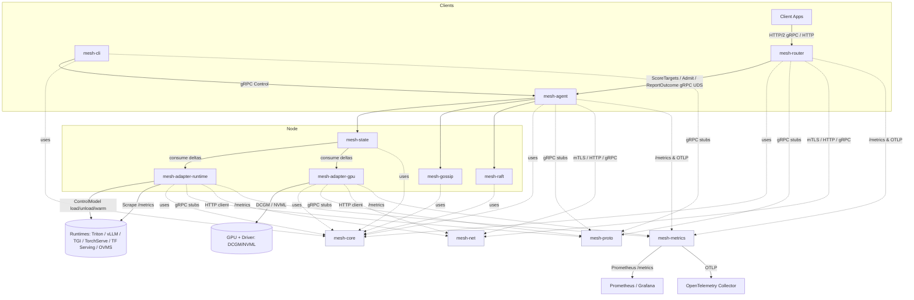

# Crates Overview – infermesh

This document provides an in-depth description of each crate in the **InferMesh** repository.  
It complements the shorter overview in the [README.md](../README.md).

---

## Workspace Layout

```
infermesh/
├─ crates/
│   ├─ mesh-core/
│   ├─ mesh-proto/
│   ├─ mesh-agent/
│   ├─ mesh-router/
│   ├─ mesh-adapter-runtime/
│   ├─ mesh-adapter-gpu/
│   ├─ mesh-cli/
│   ├─ mesh-gossip/
│   ├─ mesh-metrics/
│   ├─ mesh-net/
│   ├─ mesh-raft/
│   ├─ mesh-state/
│   └─ mesh-dev/
```

---

## Crate Details

### 1. `mesh-core`
**Role**: Foundation crate.  
**Purpose**: Defines core data structures, traits, and configuration schema shared across all other crates.  
**Responsibilities**:
- Label schema (`model`, `revision`, `gpu_uuid`, `mig_profile`, `tenant`, `zone`, etc.)
- Core structs: `Labels`, `ModelState`, `GpuState`, `SloClass`
- Traits for runtime control (`RuntimeControl`) and GPU telemetry.
- Common error handling, config parsing, constants, feature flags.
- Should avoid external heavy dependencies — keep minimal, portable.

---

### 2. `mesh-proto`
**Role**: Generated gRPC/protobuf bindings.  
**Purpose**: Define and version the public APIs of infermesh.  
**Responsibilities**:
- Protobuf definitions:
  - **Control Plane API** (`SetPolicy`, `PinModel`, `ListNodes`, etc.)
  - **State Plane API** (`ModelStateDelta`, `GpuStateDelta`, etc.)
  - **Scoring API** (`ScoreTargets`, `Admit`, `ReportOutcome`).
- `build.rs` runs `tonic-build` / `prost` to generate Rust bindings.
- Re-export generated code under `mesh_proto::{control, state, scoring}`.
- Should contain **no business logic**.

---

### 3. `mesh-agent`
**Role**: Node-level agent (`meshd`).  
**Purpose**: Runs on every node and manages membership, state, control plane, and metrics.  
**Responsibilities**:
- Hosts **gossip member** (from `mesh-gossip`).
- Hosts **Raft node** (from `mesh-raft`) for strongly-consistent policy/config replication.
- Runs **state fusion store** (from `mesh-state`) combining runtime and GPU adapters.
- Provides **local gRPC Scoring API** (`ScoreTargets`, `Admit`).
- Exposes Prometheus metrics `/metrics`.
- Runs optional OpenTelemetry exporters.
- Designed as a **small, always-on daemon**.

---

### 4. `mesh-router`
**Role**: Inference ingress router.  
**Purpose**: Accepts inference requests and forwards them to best GPU node.  
**Responsibilities**:
- HTTP/1.1, HTTP/2 (gRPC), WebSocket/SSE ingress endpoints.
- Queries local `mesh-agent` for ranked targets.
- Admission control and **hedged request scheduling**.
- Streams back inference responses to client.
- Exposes Prometheus metrics (latency histograms, queue wait, target choice distribution).
- Stateless, scalable horizontally; only depends on local `mesh-agent`.

---

### 5. `mesh-adapter-runtime`
**Role**: Runtime integration adapter.  
**Purpose**: Normalizes metrics + control API of inference runtimes (Triton, vLLM, TGI, TorchServe, TF Serving, OVMS).  
**Responsibilities**:
- Scrape or subscribe to runtime metrics (`/metrics` Prometheus).
- Convert into unified `ModelStateDelta` (queue depth, tokens/s, p95 latency).
- Implement `RuntimeControl` trait to load/unload/warm models.
- Stream deltas to local `mesh-agent`.
- Support multiple runtimes via feature flags (`--runtime triton`, `--runtime vllm`, etc.).

---

### 6. `mesh-adapter-gpu`
**Role**: GPU telemetry adapter.  
**Purpose**: Collects low-level GPU metrics via NVIDIA DCGM or NVML and reports to agent.  
**Responsibilities**:
- Poll GPU utilization, VRAM usage, MIG partition inventory, ECC/throttle status.
- Normalize to `GpuStateDelta`.
- Stream deltas to local `mesh-agent`.
- Bindings via Rust FFI to DCGM or parse `dcgm-exporter` exposition.
- Must be **lightweight**; run alongside runtime adapter on GPU nodes.

---

### 7. `mesh-cli`
**Role**: CLI tool for admins and developers.  
**Purpose**: Interacts with the control-plane API exposed by agents.  
**Responsibilities**:
- Commands: `list-nodes`, `list-models`, `pin-model`, `drain-node`, `subscribe-events`, etc.
- Connects to `mesh-agent` over gRPC (mTLS).
- Human-readable output (tables), plus `--json` for automation.
- Acts as a reference client for the API.

---

### 8. `mesh-gossip`
**Role**: Gossip membership + state dissemination.  
**Purpose**: Scalable, eventually-consistent membership and lightweight state exchange.  
**Responsibilities**:
- Implement SWIM-style protocol (ping, ack, suspect, confirm).
- Maintain cluster membership list with metadata (roles, zone, labels).
- Piggyback lightweight state deltas (health, metrics summary).
- Provide subscription API to agent (`subscribe()` → broadcast receiver).
- Must handle WAN/edge topologies gracefully.

---

### 9. `mesh-metrics`
**Role**: Unified metrics handling crate.  
**Purpose**: Export Prometheus metrics and OpenTelemetry traces/logs in a consistent way.  
**Responsibilities**:
- Register metrics across crates (router, agent, adapters).
- Expose `/metrics` endpoint (Prometheus exporter).
- OpenTelemetry integration (OTLP/HTTP, OTLP/gRPC).
- Helpers for common metrics:
  - `queue_depth`, `batch_fullness`, `work_left`
  - `gpu_utilization`, `vram_headroom`
  - router outcomes, hedged request stats
- Provide macros/helpers to instrument code consistently.

---

### 10. `mesh-net`
**Role**: Networking helpers.  
**Purpose**: Common abstractions for secure and efficient networking.  
**Responsibilities**:
- mTLS setup via Rustls (cert validation, node identity).
- Connection pooling for gRPC clients.
- Support for QUIC/HTTP3 (optional feature flag).
- Context propagation (trace headers).
- Shared code for routers, agents, and adapters.

---

### 11. `mesh-raft`
**Role**: Raft consensus wrapper.  
**Purpose**: Provide strongly consistent storage for policies, placements, ACLs, and cluster configuration.  
**Responsibilities**:
- Wrap the `tikv-raft` library into a safe API.  
- Store Raft log + snapshots on disk.  
- Provide CRUD APIs for configs (`put_policy`, `get_policy`, `pin_model`).  
- Handle leader election, log replication, and persistence.  
- Only runs in agents elected as Raft members (typically 3 or 5 nodes).

---

### 12. `mesh-state`
**Role**: State fusion and scoring engine.  
**Purpose**: Aggregate runtime + GPU + network signals into a unified state store, and expose fast queries for routing.  
**Responsibilities**:
- Maintain an in-memory cache of `ModelState` and `GpuState` keyed by `{model, node, gpu_uuid}`.  
- Apply deltas from adapters and gossip membership.  
- Compute derived metrics: `work_left`, `vram_headroom`, `net_penalty`.  
- Provide query API to router (`score_targets`, `admit`, `report_outcome`).  
- Must be lock-light, optimized for O(1) hot-path queries.

---

### 13. `mesh-dev`
**Role**: Development + testing utilities.  
**Purpose**: Provide mocks, simulators, and load generators for local testing.  
**Responsibilities**:
- Mock runtime adapter (produces synthetic metrics).  
- Mock GPU adapter (produces synthetic GPU states).  
- Load generation (synthetic inference requests).  
- Integration test harness (spawn multiple agents and routers).  
- Example configs and docker-compose setups for demos.  

---

## Implementation Guidelines

- **Small crates, clear boundaries** → each crate does one thing well.  
- **Common contracts in `mesh-core`** → no duplicate definitions.  
- **Generated code in `mesh-proto` only** → no business logic mixed.  
- **Minimal dependencies per crate** → avoid pulling heavy libs into core.  
- **Optional features via cargo features** → e.g., QUIC in `mesh-net`, OTel in `mesh-metrics`, runtimes in `mesh-adapter-runtime`.  
- **Tests live with crates** → unit tests in each crate; integration tests in `mesh-dev`.  

---

---

## Crate Connectivity Diagram

The following Mermaid diagram shows how the crates in **InferMesh** connect to each other and to external runtimes, GPUs, and observability systems.


